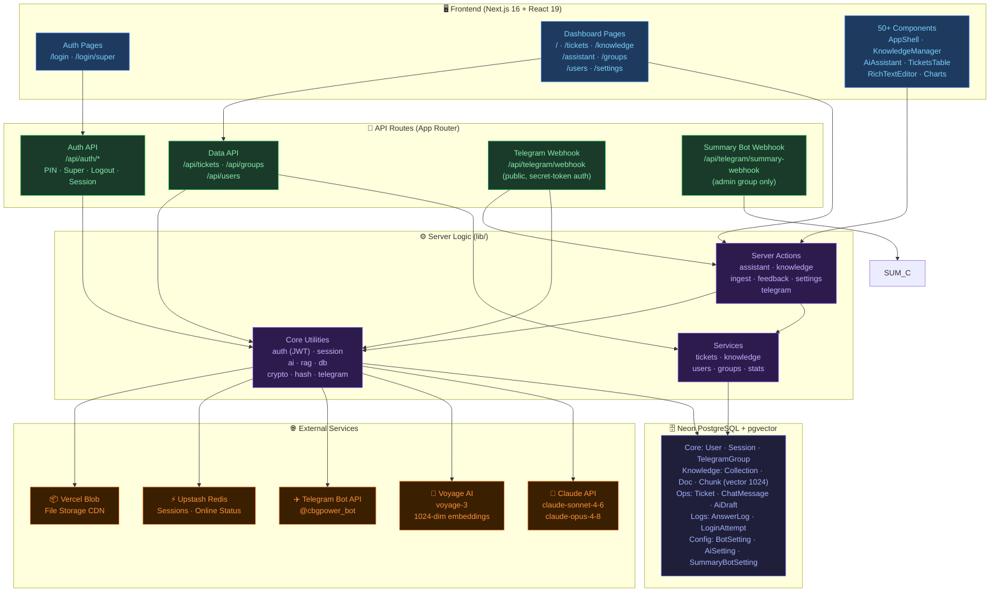
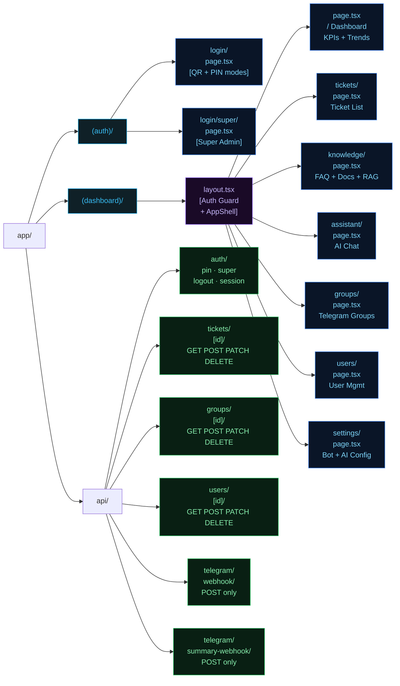
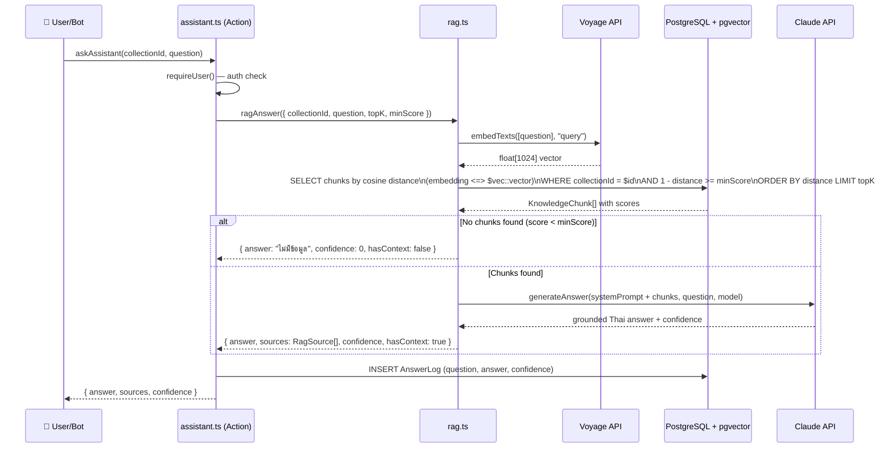
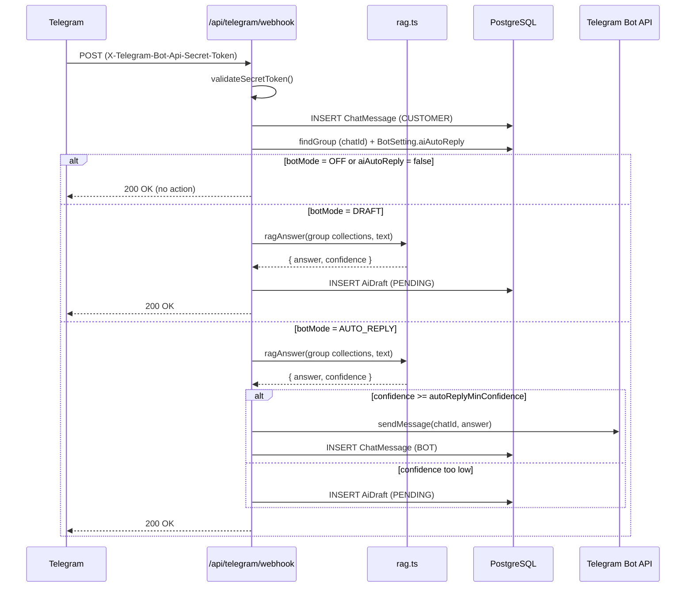
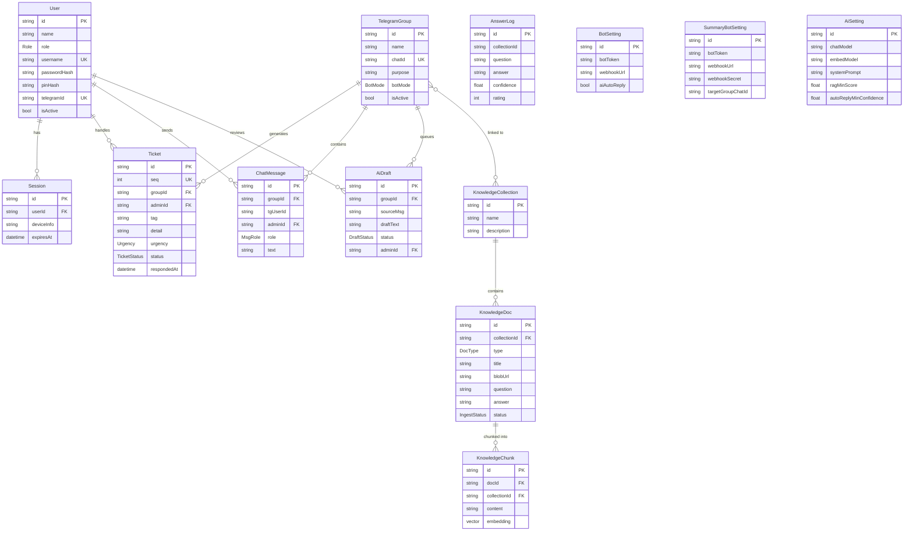
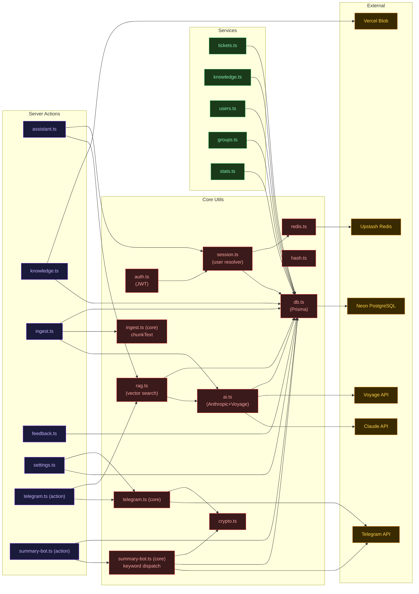

# Telabotpower — Project Map (Graphify)

> แผนที่โปรเจกต์ Telabotpower ครอบคลุมทุก layer ตั้งแต่ UI จนถึง Database

---

## 1. ภาพรวมระบบ (System Overview)



---

## 2. แผนผัง Pages & Routes



---

## 3. Data Flow — RAG Pipeline (Knowledge → AI Answer)



---

## 4. Data Flow — Telegram Bot Auto-Reply



---

## 5. Data Flow — Authentication

```mermaid
sequenceDiagram
    participant U as 👤 User
    participant P as /api/auth/pin (or /super)
    participant DB as PostgreSQL
    participant R as Redis
    participant MW as proxy.ts (Middleware)

    U->>P: POST { username, pin }
    P->>DB: findUser(username) + verifyPinHash
    
    alt Invalid credentials
        P->>DB: INSERT LoginAttempt (success=false)
        P-->>U: 401 Unauthorized
    else Valid
        P->>DB: INSERT LoginAttempt (success=true)
        P->>DB: DELETE old Session (single-session)
        P->>DB: INSERT Session { id, userId, expiresAt }
        P->>P: signSession(JWT) — HS256, payload: { sub, role, sid }
        P-->>U: Set-Cookie: session=<jwt>; HttpOnly; Secure
    end

    Note over MW: Every dashboard request
    U->>MW: GET /tickets (with cookie)
    MW->>MW: verifySession(jwt) — jose HS256
    MW->>DB: findSession(sid) — check expiry
    
    alt Session invalid/expired
        MW-->>U: Redirect /login
    else Valid
        MW->>R: setOnlineStatus(userId)
        MW-->>U: Pass through to route handler
    end
```

---

## 6. Entity Relationship Diagram (Database)



---

## 7. Module Dependency Map (lib/)



---

## 8. สรุป Key Patterns

| Pattern | ไฟล์หลัก | หน้าที่ |
|---------|----------|---------|
| **Auth (JWT + Session)** | `lib/auth.ts` + `lib/session.ts` + `proxy.ts` | PIN/Super login → JWT cookie → Middleware guard |
| **RAG Pipeline** | `lib/ai.ts` + `lib/rag.ts` + `lib/ingest.ts` | Embed → pgvector search → Claude generate |
| **Telegram Bot** | `lib/telegram.ts` + `/api/telegram/webhook` | Webhook → RAG → auto-reply or draft queue |
| **Role-Based Access** | `lib/session.ts#requireRole()` | SUPER_ADMIN > MANAGER > ADMIN |
| **Mock Toggle** | `lib/use-mock.ts` + `NEXT_PUBLIC_USE_MOCK` | Dev without DB (mock data) |
| **Single Session** | `lib/session.ts` + Session model | New login kills old session |
| **Dynamic Config** | `AiSetting` + `BotSetting` + `SummaryBotSetting` in DB | RAG params + bot tokens, no redeploy needed |
| **Summary Bot** | `lib/summary-bot.ts` + `/api/telegram/summary-webhook` | Keyword-triggered admin group bot → pulls live DB stats |
| **File Storage** | `lib/actions/knowledge.ts` + Vercel Blob | Upload → Blob URL → store in DB → ingest |

---

> Generated: 2026-06-24 | Updated: 2026-06-29 (Summary Bot) | Stack: Next.js 16 · Prisma 6 · Neon + pgvector · Claude + Voyage · Upstash Redis · Vercel Blob
